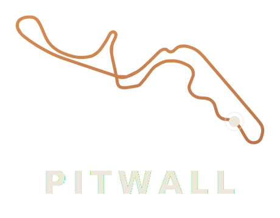
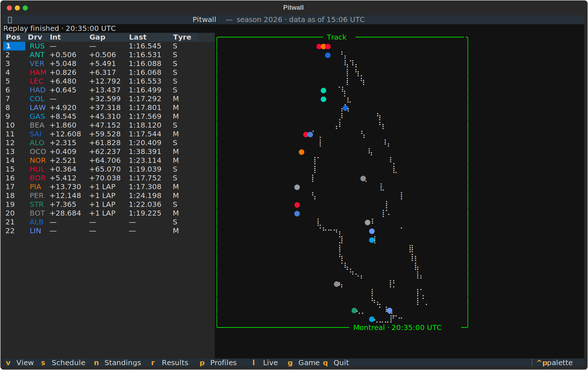

<p align="center">
  
</p>

<p align="center">
  <em>An open-source terminal companion for following Formula 1, from a fan's pit wall.</em>
</p>

<p align="center">
  <a href="https://elessar617.github.io/Pitwall/"><strong>Website</strong></a> ·
  <a href="https://elessar617.github.io/Pitwall/getting-started/">Getting started</a> ·
  <a href="https://elessar617.github.io/Pitwall/reference/keys/">Keyboard reference</a>
</p>

---

**Pitwall** is a Python TUI for F1: live timing with a braille track-position
map, a full season tracker, and a strategy mini-game you play against the
actual race.



## Features

- **Season tracker** — schedule with UTC session times, drivers' and
  constructors' standings, per-round results, driver/constructor profiles.
  Cache-first from the [Jolpica F1 API](https://github.com/jolpica/jolpica-f1):
  instant startup, graceful offline degradation.
- **Live timing & track map** — a timing tower with team-coloured driver codes
  beside a circuit outline **drawn from the cars' own telemetry** via
  [OpenF1](https://openf1.org/), rendered in braille at terminal resolution —
  every car a marker in its team colour. Battle views (`v`) focus the lead
  fight, the podium, or the points battle. Works live (`--live`) or against a
  recorded replay that ships in this repo.
- **Strategy mini-game** — commit a tyre + pit plan before lights out, answer
  pit-window prompts mid-race, get scored against what the driver actually did.

## Run it

Not yet on PyPI — run straight from GitHub with [uv](https://docs.astral.sh/uv/):

```bash
uvx --from git+https://github.com/Elessar617/Pitwall pitwall
```

Or clone it:

```bash
git clone https://github.com/Elessar617/Pitwall
cd Pitwall
uv run pitwall                                                  # live season data
uv run pitwall --replay tests/fixtures/openf1/1285_11291_excerpt  # offline replay demo
uv run pitwall --live                                           # follow a live session
```

Pitwall requires Python 3.13+, and `uv` provisions that interpreter for you.

The replay demo is the fastest tour: press `l` for the timing tower + track
map (press `v` to cycle battle views), `g` to play the strategy game. Keys:
`s` schedule · `n` standings · `r` results · `p` profiles · `l` live ·
`g` game · `v` views · `q` quit.

## Development

```bash
uv sync                          # install dev deps
uv run pytest -W error           # full Python suite, warnings as errors, doctests on
uv run ruff check . && uv run ruff format --check .
uv run ty check
uv build
```

Every feature shipped through a TDD pipeline with an adversarial review gate;
tests are offline-deterministic against real recorded API payloads.

## Data sources

- [**Jolpica-F1**](https://github.com/jolpica/jolpica-f1) — schedule, standings,
  results, rosters (the Ergast successor).
- [**OpenF1**](https://openf1.org/) — laps, intervals, positions, stints, pit
  stops, race control, and car location telemetry.

## Acknowledgments

- Structurally inspired by [`faceoff`](https://github.com/vgreg/faceoff) (NHL
  TUI) by Vincent Grégoire — same Python + [Textual](https://textual.textualize.io/)
  stack, same love of the terminal.
- Spiritual nods to [F1 MultiViewer](https://multiviewer.app/) and
  [Golden Lap](https://store.steampowered.com/app/2052040/Golden_Lap/).

## Roadmap

Shipped all three pillars (v0.1.0–v0.3.0). See [ROADMAP.md](ROADMAP.md) for what's next, what's deferred, and what's explicitly out of scope.

## Disclaimer

This project is not affiliated with, endorsed by, or in any way officially
connected with Formula 1, the FIA, FOM, any team, or their affiliates. All F1
names and trademarks are the property of their respective owners. Pitwall uses
publicly available data for informational and educational purposes only.

## License

MIT — see `LICENSE`.
