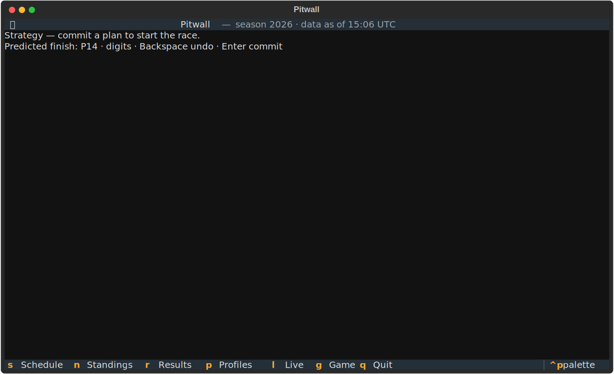
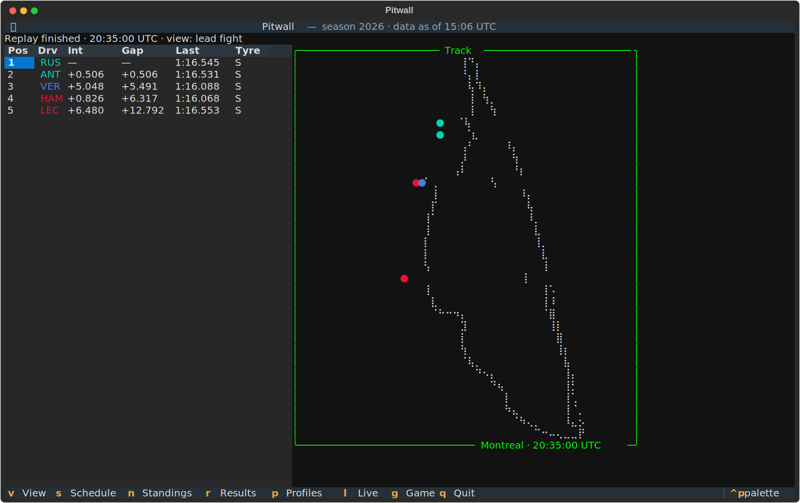

# Building Pitwall

This is the long version: how Pitwall went from "could you follow a Grand Prix
from a terminal?" to a published app with live timing, a track map drawn from
the cars' own telemetry, a season tracker, and a strategy game you play against
a real race.

It is written for three kinds of reader: someone who found the repo and wants
the story behind it, an F1 fan who also writes code, and anyone building a
terminal app who wants the *how*. It is honest about the dead ends, because the
dead ends are where most of the decisions actually got made.

<figure class="pitwall-shot" markdown>

<figcaption>The finished thing: the timing tower and the track map, both drawn from real car telemetry.</figcaption>
</figure>

## The goal, and why a terminal

The broadcast is excellent. So why build a CLI?

Because a terminal is a different kind of seat. It starts in about a second, it
runs over SSH, it sits in a tmux pane next to the work you were already doing,
and it asks nothing of your graphics stack. The constraint — monospace cells,
no pixels — turned out to be the interesting part, not the limitation. A race
is fundamentally a table of numbers that changes every second, plus twenty-odd
dots moving around a loop. Both of those things fit a grid of characters
beautifully.

The plan was three pillars, shipped in order:

1. **A season tracker** — schedule, standings, results, profiles.
2. **Live timing and a track map** — the in-session view.
3. **A strategy mini-game** — play your own pit strategy against the real race.

Each shipped as its own version (`v0.1.0`, `v0.2.0`, `v0.3.0`) so the thing was
always runnable, never a half-finished branch.

## De-risking the data before writing the app

The riskiest part of an F1 app is not the UI. It is the data. Two public
sources do most of the work, and they have very different shapes:

- **[Jolpica-F1](https://github.com/jolpica/jolpica-f1)** (the Ergast
  successor) — schedule, standings, results, rosters. Slow-moving, structured,
  the season skeleton.
- **[OpenF1](https://openf1.org/)** — laps, intervals, positions, stints, pit
  stops, race control, and crucially *car location telemetry*. High-volume,
  per-session, ephemeral.

Rather than guess, the project started with time-boxed spikes whose only job was
to answer "pursue, modify, or abandon?" — throwaway code, real verdicts.

Two findings from those spikes shaped everything after:

- **OpenF1's location stream is dense enough to draw a track on its own.** The
  samples come in at roughly 3.8 Hz per car. That is enough resolution that one
  full lap traces the circuit — which meant the heavier
  [FastF1](https://github.com/theOehrly/Fast-F1) dependency could be dropped
  entirely, and a whole planned spike could be cancelled. The track map would be
  built from the *cars' own positions*, not from a stored circuit map.
- **The data lies about being "live."** OpenF1's newest-session location data
  can lag by days, and per-driver coverage is patchy. A genuinely-live track map
  may legitimately never appear for a given session. That is not a bug to fix;
  it is a property to design around. Everything downstream had to tolerate
  missing data per driver and missing location everywhere.

A few client rules also fell out of the spikes and got baked in: percent-encode
the `>`/`<` operators inside OpenF1 date filters, and treat an OpenF1 `404` as an
empty window rather than an error (it returns `404` for a valid-but-empty query).

## v0.1.0 — the season tracker

The first pillar is the least glamorous and the one that set the architecture.

### Cache-first, offline-first by construction

Season data is small and changes only when sessions run. So the data layer is a
read-through cache over SQLite: ask for a scope (schedule, standings, a round's
results), and if a fresh copy is cached, it comes back with zero network calls.
That is what makes startup feel instant.

The interesting decision is *when* the cache is considered stale. A flat
time-to-live is wrong here — standings do not change at 3 a.m. on a Tuesday.
Instead, staleness is keyed to the calendar: a 24-hour fallback, *plus*
invalidation the moment any real session start time falls between the last fetch
and now.

```python
# Invariant: comparison operations must be performed using timezone-aware datetimes.
# Failure Mode: if the age meets or exceeds FALLBACK_TTL, the cache is immediately invalid.
if now - fetched_at >= FALLBACK_TTL:
    return True

# Invariant: a session start strictly within (fetched_at, now) invalidates the cache.
return any(fetched_at < start < now for start in session_starts)
```

The session start times come from the cached schedule itself, so the cache
knows when to invalidate *itself* right after a race or qualifying runs. This
function reads no clock of its own — `now` is passed in — which makes it
deterministic and trivial to test.

The other half is what happens when the network fails. With a cache present, a
fetch failure serves the last-known data, flagged as stale, instead of throwing
up an error screen. With no cache at all, the error is allowed to surface
loudly, because there is genuinely nothing to show.

```python
if not stale:
    # Invariant: serve fresh cached data immediately.
    return StoreResult(data=cached_data, fetched_at=fetched_at, source=Source.CACHE)

# 3. Cache miss or stale data: perform network fetch
try:
    data = await fetch_fn()
except JolpicaError:
    # Invariant: serve degraded stale cache if we have a valid cache present, else propagate error.
    if cache_present and fetched_at is not None:
        return StoreResult(data=cached_data, fetched_at=fetched_at, source=Source.STALE_CACHE)
    raise
```

That `Source.CACHE` / `Source.NETWORK` / `Source.STALE_CACHE` distinction is not
internal trivia — it drives the UI. When a screen renders stale data, the
subtitle says so ("data as of HH:MM UTC · stale") and a warning toast fires. The
app never silently pretends old data is current. Because the degraded path *is*
the offline path, a separate `--offline` flag was never needed.

### The Textual chassis

The UI is built on [Textual](https://textual.textualize.io/). The shell is one
app with six registered screens and a flat, single-key navigation model:

```python
SCREENS: ClassVar[dict] = {
    "schedule": ScheduleScreen,
    "standings": StandingsScreen,
    "results": ResultsScreen,
    "profiles": ProfilesScreen,
    "live": LiveTimingScreen,
    "strategy": StrategyScreen,
}
BINDINGS: ClassVar[list[Binding]] = [
    Binding("s", "show_screen('schedule')", "Schedule"),
    Binding("n", "show_screen('standings')", "Standings"),
    Binding("r", "show_screen('results')", "Results"),
    Binding("p", "show_screen('profiles')", "Profiles"),
    Binding("l", "show_screen('live')", "Live"),
    Binding("g", "show_screen('strategy')", "Game"),
    Binding("q", "quit", "Quit"),
]
```

Two architectural choices here paid off repeatedly:

- **One source of truth for season data.** The app loads the season once per
  launch into a reactive variable; the four season screens *watch* it and render
  when it lands, rather than each fetching their own copy. Data flows
  worker → reactive var → per-screen render.
- **No custom widgets, no stylesheet files.** The UI is composed from Textual's
  built-ins (`DataTable`, `Static`, `Header`, `Footer`); the "art" — the track
  map, the game panels — is Rich `Text` rendered into a `Static`. Layout lives in
  per-class CSS string literals. Fewer moving parts, fewer lifecycles to reason
  about.

All I/O runs in Textual workers, grouped by purpose, and the live and strategy
screens cancel their worker group when you navigate away *and* on unmount — so
switching screens reliably tears down any background polling or replay loop.

`v0.1.0` shipped four data screens over that cache-first layer, tested
offline-deterministically against real recorded payloads. Live data, the track
map, and the game were explicitly out of scope — and saying so out loud kept the
release small.

<!-- TODO(new-art): a small diagram of the data flow — Jolpica → SeasonStore (SQLite read-through) → reactive snapshot → screens — would help here. -->

## v0.2.0 — live timing and the track map

This is the pillar people remember, and the track map is the heart of it.

### Drawing a circuit from telemetry, in braille

There is no circuit map in this repo. None. The outline you see is the union of
every car position sample, drawn as dots. Where cars have driven *is* the track.

The trick that makes it readable at terminal resolution is the braille block.
Each monospace cell holds a 2×4 grid of dots (the Unicode braille patterns,
`U+2800`–`U+28FF`), so a 56×32 grid of characters becomes a 112×128 dot raster —
eight times the effective resolution of plain block characters in the same
footprint.

First, fit the telemetry to that dot grid. The only subtlety is preserving the
aspect ratio so the circuit is not stretched:

```python
span_x = x_max - x_min
span_y = y_max - y_min

# Guard: prevent division by zero for degenerate single-point lists.
scale = min(111.0 / max(span_x, 1.0), 127.0 / max(span_y, 1.0))
offset_x = (111.0 - span_x * scale) / 2.0
offset_y = (127.0 - span_y * scale) / 2.0
```

`111` and `127` are the last valid dot indices of the 112×128 grid. Taking the
*minimum* of the two axis ratios is the whole "fit any circuit, never distort"
behaviour: the larger axis fills the grid, the smaller one is centred with the
offsets. `max(span, 1.0)` keeps a degenerate single-point input from dividing by
zero.

Then rasterise: for each point, find its dot, split that into a character cell
plus a sub-cell position, and OR the corresponding braille bit into that cell.

```python
for p in points:
    dot_col, dot_row = proj.dot_for(p.x, p.y)
    col = dot_col // 2
    row = dot_row // 4
    dx = dot_col % 2
    dy = dot_row % 4
    if 0 <= col < MAP_GRID_WIDTH and 0 <= row < MAP_GRID_HEIGHT:
        grid[row][col] |= BIT_MAP[(dx, dy)]

lines = []
# Loop Bound: 32 rows.
for r in range(MAP_GRID_HEIGHT):
    row_chars = []
    # Loop Bound: 56 columns.
    for c in range(MAP_GRID_WIDTH):
        row_chars.append(chr(0x2800 + grid[r][c]))
    lines.append("".join(row_chars))
```

A few details that only show up once you try it on real data:

- **The Y axis is flipped** (`y_max - y`), because terminal rows grow downward
  while track Y grows upward. Skip this and your circuit is upside down.
- **The outline is built once and frozen.** Cars then ride *on top* as `●`
  markers, each tinted with its team colour. The static outline is never mutated;
  markers are overlaid onto a copy each tick.
- **Collisions are deterministic.** When two cars map to the same braille cell,
  the higher car number wins — a small, test-pinned tie-break so the render never
  depends on dict ordering.
- **Off-grid is silently dropped, not crashed.** A car beyond the projected
  bounds adds no dot and raises nothing.

The map lives in a bordered panel captioned like `Montreal · 14:03:21 UTC`. That
timestamp is pulled out of the same status string the timing tower shows, by
regex, rather than read from an independent clock — so the caption can never
drift out of sync with the data it labels.

<figure class="pitwall-shot" markdown>

<figcaption>Tower and map share one tick stream, whether it is live or a replay.</figcaption>
</figure>

<!-- TODO(new-art): an annotated zoom of a single braille cell showing the 2×4 dot bit layout (U+2800 + mask) would make the rasterisation section land. -->

### Team colours, and a small security gotcha

A driver's three-letter code in the tower and their dot on the map share one
colour, derived from one source: OpenF1's `team_colour` field. That field is an
external string, so it is validated before it is ever trusted as a style:

```python
def style_for_team_colour(colour: str | None) -> str:
    """Resolve CSS color style string for team_colour."""
    if colour and re.fullmatch(r"[0-9a-fA-F]{6}", colour):
        return f"#{colour}"
    return ""
```

This is part of a wider rule: *every* API or replay string is wrapped in Rich
`Text` before it reaches the screen, so a field like a session name or an
interval can never be interpreted as terminal markup. A driver with no published
colour falls back to the default style instead of breaking the row.

### Replay first, live second

The same screen renders a live session and a recorded one through a single
`TickSource` protocol. That was deliberate: the replay engine is a pure,
clock-free, deterministic merge of recorded streams into one ordered timeline,
played back at a configurable speed (default ×60). Because it is deterministic
and offline, the *entire* live experience is testable against committed
fixtures — no network, no wall clock.

The repo ships one such fixture: a short excerpt of the 2026 Canadian Grand Prix
at Circuit Gilles Villeneuve. It is the fastest way to see the app do its thing:

```console
$ pitwall --replay tests/fixtures/openf1/1285_11291_excerpt --replay-speed 10
```

Genuinely-live mode (`--live`) discovers the latest session, polls each stream
under one request per second with per-stream cursors and dedupe, and contains
failures *per stream* — one bad poll yields an empty tick and bumps a failure
counter rather than killing the screen. Because live behaviour cannot be
exercised deterministically in CI, it ships with an operator-run validation
checklist instead.

`v0.2.0` was fixed-width at first (an 80×24 split). Responsive widths were
deferred on purpose — a note for later, not a blocker for shipping.

## v0.3.0 — the strategy mini-game

The last pillar turns watching into playing. Press `g` during a replay, and
before lights-out you commit a strategy: which tyres, in which order, and which
laps you will pit on. Then you react to pit-window prompts as the race runs, and
at the end you are scored against what the driver *actually* did.

### A pure core, a thin screen

The game logic is a set of pure functions over frozen dataclasses, with the
Textual screen as a thin orchestrator on top. The plan wizard is a key-driven
state machine: every keystroke returns a new immutable draft. The plan model
re-validates everything on construction — compound names, stint count, that pit
laps are strictly increasing and number one fewer than the stints — so even
though the wizard validates as you type, the model is the last gate before
scoring sees it.

Mid-race, a fold over each tick detects when you are entering a pit window. The
window opens on the lap before your planned stop *and* the planned lap itself:

```python
elif event.kind == "lap_started":
    lap = payload.lap_number
    # Lowest unprompted planned lap whose window {L-1, L} contains this
    # lap: L-1 gives one lap of warning; L covers lap-data gaps.
    for planned in sorted(plan.pit_laps):
        if planned not in prompted and lap in (planned - 1, planned):
            prompted.add(planned)
            prompts.append(GamePrompt("window", lap, planned))
            break
```

The lap-before gives you a lap of warning; the planned lap itself covers the
case where lap data is missing. Prompts queue FIFO, and the prompt you *see* is
always the head of the queue, so pressing `1` (pit now) or `2` (stay out) always
answers exactly what is on screen.

### Scored against reality, not a simulator

This is the design decision worth being precise about: **there is no tyre
simulator.** Scoring does not model degradation or predict an outcome. It is a
deterministic diff between your committed plan and the driver's *observed*
behaviour, reconstructed straight from the replay's stint, pit, and position
records:

```python
driver_stints = sorted((s for s in stints if s.driver_number == driver_number), key=lambda s: s.stint_number)
if not driver_stints:
    return ActualOutcome((), (), (), None)
compounds = tuple(s.compound if s.compound is not None else "?" for s in driver_stints)
pit_laps = tuple(s.lap_end for s in driver_stints[:-1])
return ActualOutcome(compounds, pit_laps, state.pit_event_laps, state.last_position)
```

From there, one pinned formula awards points: a match on each stint's compound,
accuracy on each pit lap (exact or within a lap), whether your in-race decisions
lined up with the real stops, and how close your predicted finish was. The total
is always the sum of its parts, and it can go negative. The one "prediction" in
the whole game is *your* guessed finishing position — scored for accuracy, not
produced by any model. (A degradation model is a deferred idea, dependent on a
data source that does not exist yet.)

<figure class="pitwall-shot" markdown>

<figcaption>Commit a plan before lights-out; the wizard gates the race until you do.</figcaption>
</figure>

The adversarial review pass earned its keep on this pillar: it found a real
defect where two pit windows opening on the same tick could corrupt the
prompt/decision pairing. It was reproduced with a dedicated test, fixed by the
head-of-queue invariant above, and re-verified. The game is replay-only — playing
live conflicts with how live sessions back-fill their data, so it was deferred
rather than bodged.

## Hardening: battle views, an audit, and a bigger map

With all three pillars shipped, the next stretch was about making the live
experience hold up.

**Battle views.** Press `v` to cycle focus — all cars, the lead fight (P1–P5),
the podium fight (P1–P4), or the points fight (P8–P12). The same filter applies
to the tower *and* the map markers, so the two surfaces always agree on who is
shown, while the full circuit outline stays drawn.

<figure class="pitwall-shot" markdown>

<figcaption>One fight at a time. The tower and map filter together.</figcaption>
</figure>

**The audit.** A deliberate completion audit caught two genuinely
high-severity issues that tests had been quietly missing:

- The type-checker had been configured to exclude all of `src/`. Every prior
  "type-clean" claim was therefore vacuous for the production code. Re-including
  the source surfaced — and then closed — dozens of latent diagnostics.
- A malformed live record could slip past *both* error-containment layers and
  crash the app mid-session. Fixed with a bridging error type and by wrapping the
  JSON decode.

The lesson there is an old one, learned again: a green test suite only proves
what it is actually allowed to check.

**A bigger track map.** The original map was cramped — the trace under-filled
its grid. The fix enlarged it to the current 56×32 braille panel, centred it in
a round border with a caption, and made the layout responsive: the map appears
once the terminal is at least 100 columns wide, and below that the timing tower
expands to fill the width on its own. The projection maths did not change at all
— the dots were already aspect-correct, so only two grid-extent constants moved.
One glitch slipped through anyway: a one-column border-wrap that was only visible
in a real terminal, not in tests. The terminal is the final test.

## Shipping it

`v0.3.0` is the public release: install straight from GitHub with `uv`, no PyPI
step yet.

```console
$ uvx --from git+https://github.com/Elessar617/Pitwall pitwall
```

Alongside the app, this documentation site went up on GitHub Pages. The launch
was not entirely clean: the header logo rendered at 0×0. The cause was a favicon
SVG that declared only a wide `viewBox` with no intrinsic width or height, so the
browser had no dimensions to lay it out with. Rewriting it as a square SVG with
explicit `width`/`height` (and an accessible label) brought the logo back. A
small bug, but a fitting last-mile reminder that "works in the renderer I tested"
is not the same as "works."

## What I would tell you if you were starting your own

- **De-risk the data first.** The spikes that produced throwaway code saved the
  most time, because they turned "I hope this works" into "I know this works, and
  here is the constraint list."
- **Let the degraded path be the normal path.** Cache-first with stale-serve
  meant offline support was free, not a feature to bolt on.
- **Make the hard parts pure.** The projection maths, the event folds, the
  scoring — all pure functions over immutable data. They are the parts most worth
  testing and the parts most painful to debug if they hide state.
- **The terminal is the final test.** More than one bug only ever appeared in a
  real render at a real width.

All three pillars are shipped. What is next, deferred, and explicitly out of
scope lives in [the roadmap](https://github.com/Elessar617/Pitwall/blob/main/ROADMAP.md).
The source is on [GitHub](https://github.com/Elessar617/Pitwall) — clone it, run
the replay demo, and watch a racetrack draw itself out of nothing but the cars.
