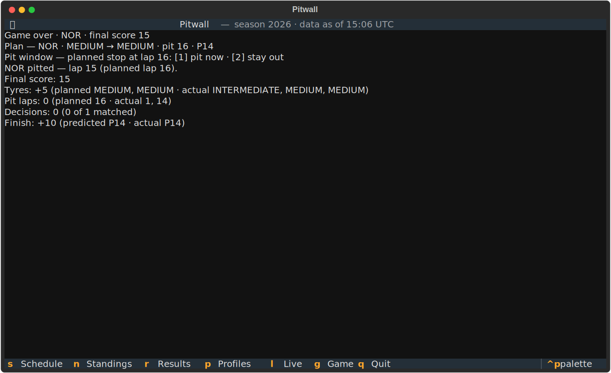

# Strategy game

Think you can out-call the pit wall? Commit a strategy before lights out, react
to the race as it happens, and get scored against what the driver actually did.

## 1 — Commit a plan

Press <span class="pitwall-key">g</span> during a replay. A four-step wizard
walks you through driver, tyre compounds, pit laps, and a predicted finishing
position. Nothing starts until you commit — the replay is gated on your plan.

<figure class="pitwall-shot" markdown>

</figure>

## 2 — Race the race

As laps tick by, pit-window prompts fire one lap before each planned stop:

```
Pit window — planned stop at lap 16: [1] pit now · [2] stay out
```

Answer with <span class="pitwall-key">1</span> or
<span class="pitwall-key">2</span>. When the driver actually pits, the event
line tells you how close your plan was.

## 3 — Get scored

At the end of the window the score panel breaks it down: tyre-compound matches,
pit-lap accuracy, decision quality, and finishing-position prediction.

<figure class="pitwall-shot" markdown>

</figure>

| Component | Scoring |
| --- | --- |
| Tyres | +10 per matching compound, −5 per stint-count miss |
| Pit laps | +10 exact, +5 one lap off |
| Decisions | +5 when your call matched reality, −5 when it didn't |
| Finish | +10 exact, +5 within two places |
