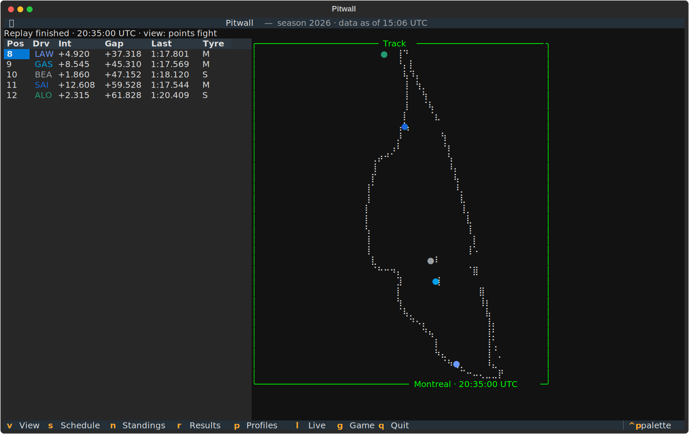

# Live timing & track map

The live screen pairs a timing tower with a track-position map — both driven by
the same tick stream, whether that stream is a live session or a replay.

<figure class="pitwall-shot" markdown>

</figure>

## The timing tower

Position, driver, interval, gap to leader, last lap, and tyre compound — folded
incrementally from lap, interval, position, and stint telemetry. Lapped cars
show `+1 LAP`; retired cars keep their last known state.

## The track map

The circuit outline is **drawn from the cars' own telemetry** — x/y location
samples projected onto a braille grid, so one full lap traces the track at
2×4 dots per terminal cell. **Every covered car** appears as a marker in its
team colour, updated each tick.

The track map sits in its own bordered panel, captioned with the circuit
and the current session time, and grows to fill a wide terminal.

## Team colours

Driver codes in the tower and markers on the map are tinted with each team's
real colour, straight from the OpenF1 drivers feed — McLaren papaya, Ferrari
red, Mercedes teal. Drivers without a published colour fall back to the
default text style instead of breaking the row.

## Battle views

Press <span class="pitwall-key">v</span> to cycle focused views — the tower
*and* the map filter together, so you watch one fight at a time:

| View | Who's in it |
| --- | --- |
| all | every classified car (and the unclassified, listed last) |
| lead fight | P1–P5 |
| podium fight | P1–P4 |
| points fight | P8–P12, straddling the points cutoff |

<figure class="pitwall-shot" markdown>

</figure>

<figure class="pitwall-shot" markdown>

</figure>

## Replay engine

Replays are first-class: a deterministic engine merges every recorded stream
into one ordered timeline and plays it back at a configurable speed multiplier.
The repo ships a 60-second Canadian Grand Prix excerpt:

```console
$ pitwall --replay tests/fixtures/openf1/1285_11291_excerpt --replay-speed 10
```

## Live mode

`pitwall --live` discovers the latest session from OpenF1 and polls it at under
one request per second, with per-stream cursors and deduplication. Failures
degrade per-stream — one bad poll never kills the screen.
