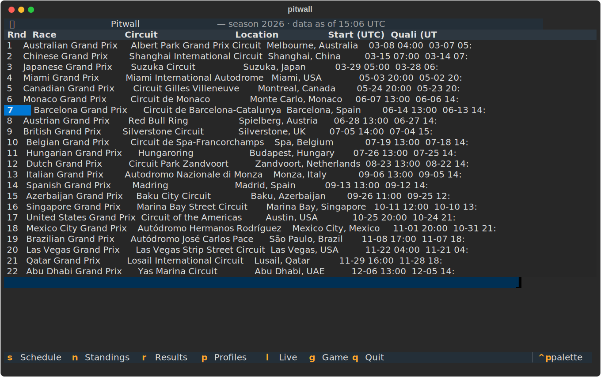
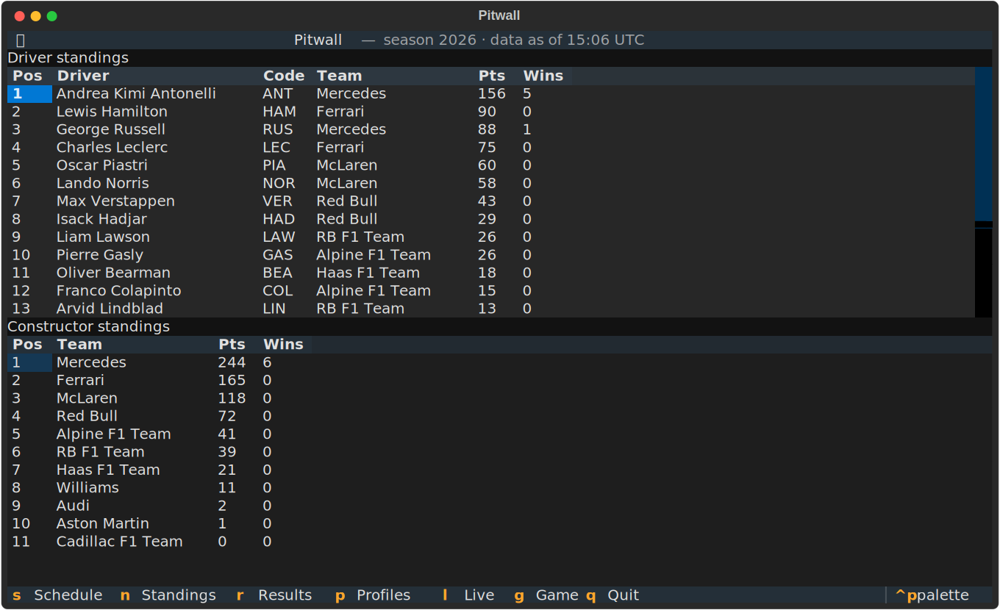
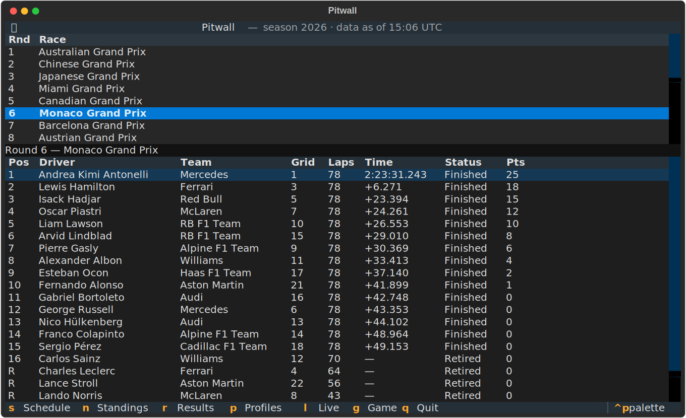
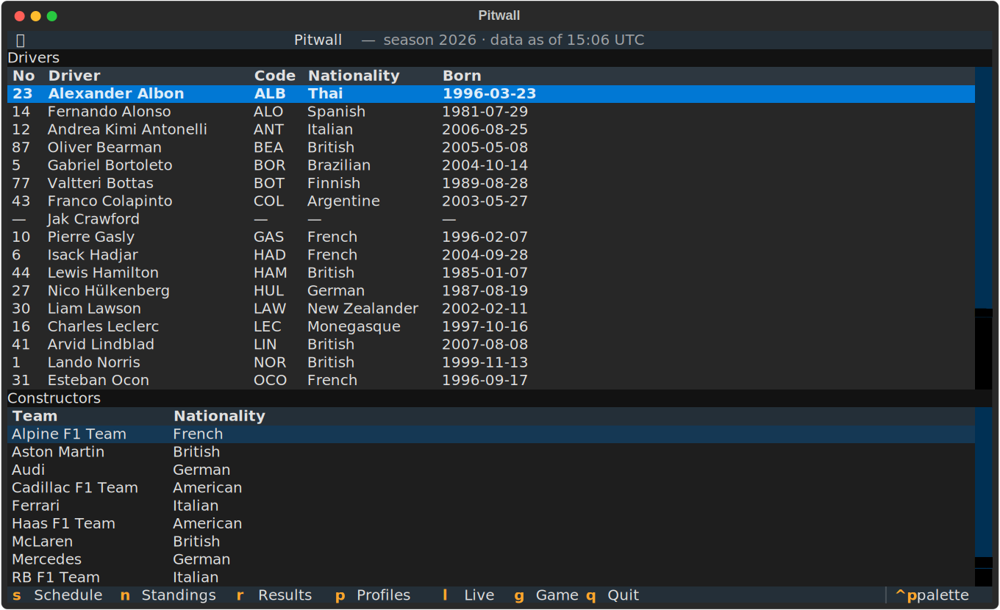

# Season tracker

Everything you need between race weekends: the calendar, both championships,
results, and who's who — all cached locally so the app opens instantly and
survives flaky networks.

## Schedule

The full calendar with race, qualifying, and sprint times in UTC. The cursor
lands on the next race automatically.

<figure class="pitwall-shot" markdown>

</figure>

## Standings

Drivers' and constructors' championships, stacked in one view.

<figure class="pitwall-shot" markdown>

</figure>

## Results

Pick any round from the season list and the finishing order loads on demand —
grid position, laps, race time, status, and points per driver.

<figure class="pitwall-shot" markdown>

</figure>

## Profiles

Driver and constructor rosters with numbers, codes, nationalities and birth
dates.

<figure class="pitwall-shot" markdown>

</figure>

!!! info "Cache-first by design"
    Season data comes from the Jolpica F1 API into a local SQLite cache. If a
    fetch fails, Pitwall serves the cached data and marks the subtitle
    `· stale` — no spinners, no blank screens.
